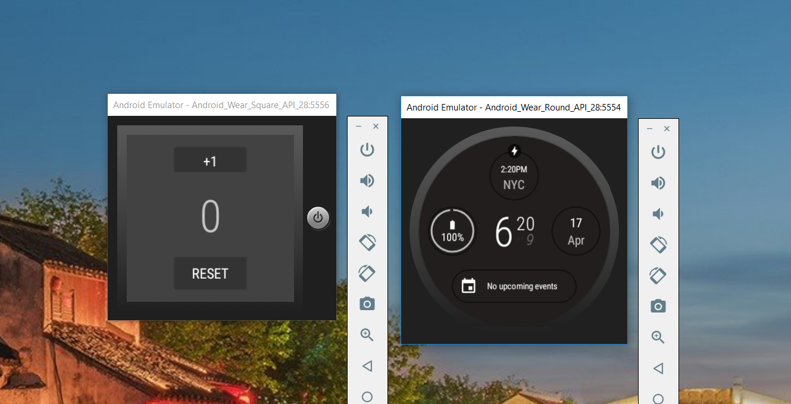
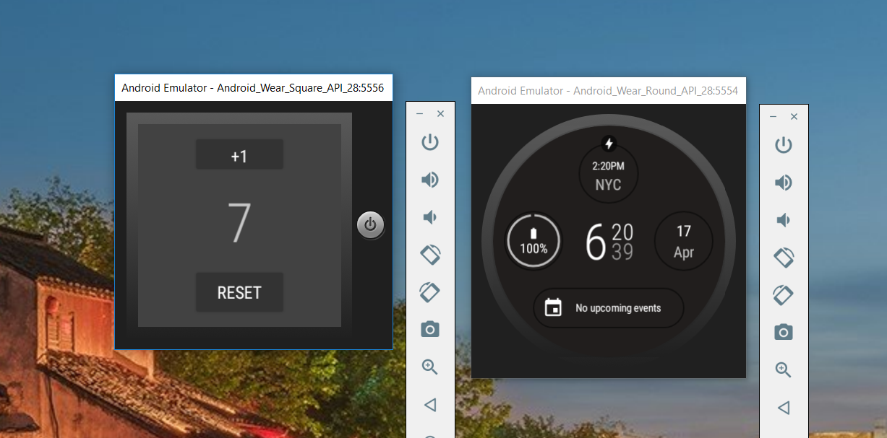

# Counter for Android wearables

## Android Studio App using Oreo
### Chapter 13: Android Wear Mini Course - App Counter

* The count on your wearable will increase as you touch your device.
* You can always reset your count with the touch of a button on the screen.

 
*Counter at zero*

*Using the +1 to increase the count*

